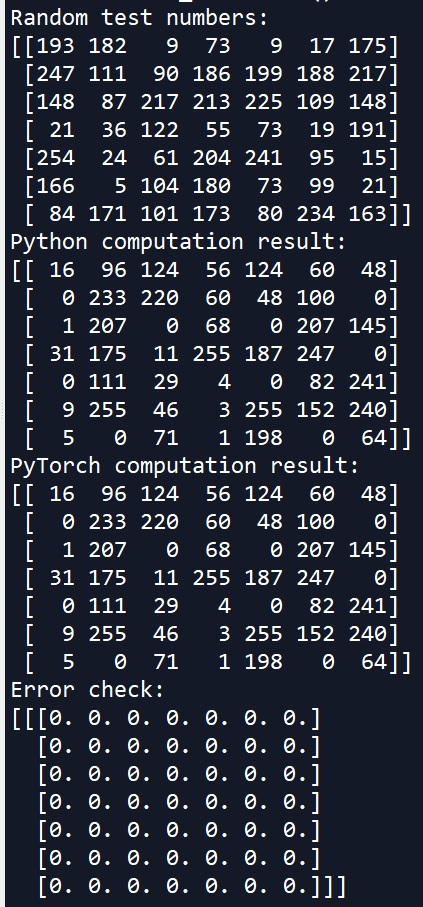

# Computation of local binary patterns using PyTorch

Akgun, Devrim. "A PyTorch Operations Based Approach for Computing Local Binary Patterns." U. Porto Journal of Engineering 7.4 (2021): 61-69.

Bibtex

@article{akgun2021pytorch,
  title={A PyTorch Operations Based Approach for Computing Local Binary Patterns},  
  author={Akgun, Devrim},  
  journal={U. Porto Journal of Engineering},  
  volume={7},
  number={4},  
  pages={61--69},  
  year={2021}  
}
