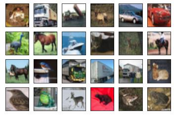
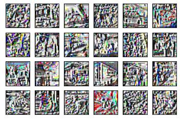
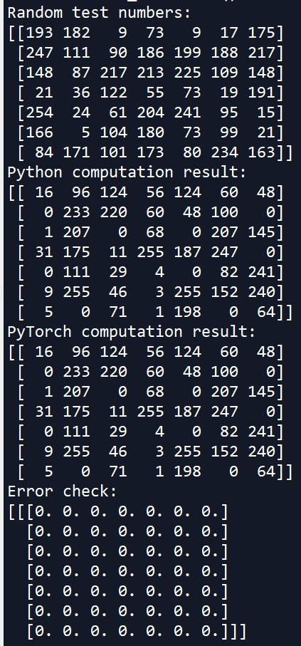

# Computation of local binary patterns using PyTorch

Cite this study if you find it useful:
[Akgun, D. "A PyTorch Operations Based Approach for Computing Local Binary Patterns." U. Porto Journal of Engineering 7.4 (2021): 61-69.0,  doi.org/10.24840/2183-6493_007.004_0005 ](https://www.researchgate.net/publication/356572689_PyTorch_Operations_Based_Approach_for_Computing_Local_Binary_Patterns)

Bibtex

@article{akgun2021pytorch,
  title={A PyTorch Operations Based Approach for Computing Local Binary Patterns},  
  author={Akgun, Devrim},  
  journal={U. Porto Journal of Engineering},  
  volume={7},
  number={4},  
  pages={61--69},  
  year={2021}  
}
